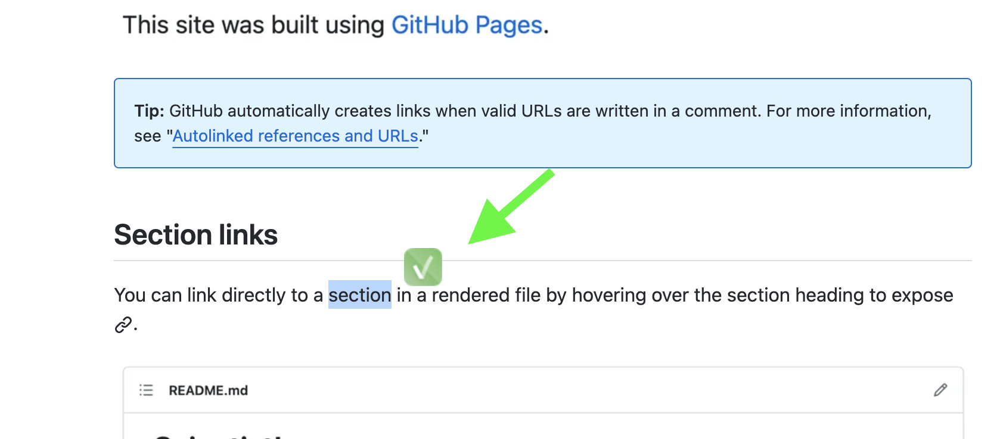
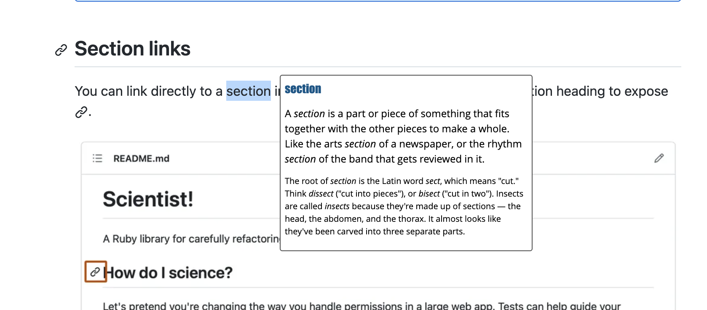
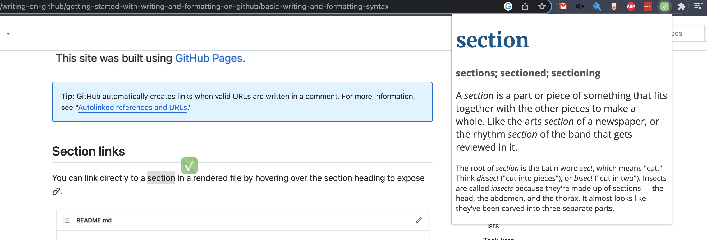

# vocabulary-com-chrome-extension

This repo is intended to store all of the source files for the Google Chrome browser extension that can provide you with the definition and/or the meaning of the English word that is currently selected on the active webpage.

Extension queries selected word on the [vocabulary site][vocabulary-site] and writes it back to the webpage on top of the text.

This extension was inspired by the [Google Translate][google-translator] browser extension that simply translates to your language currently selected word on the web page. So this one is pretty similar by the behaviour. At least I tried to do it as much usable and useful as possible.

# Disclaimers

I am not a professional software developer in general and on JavaScript specifically so please do not hate my code 😂.

For now, the extension does what I initially wanted. However, I'm going to work on some improvements and fixes as I noticed some pages where the extension works in wrong way. Please refer to the [#TODO](#TODO) secion to see what I have in my "backlog".

This extension cannot be anyhow treated as an official extension for the `vocabulary.com` site. It just uses some limited and short set of its capabilities.

# How it works

There are the following moving parts in this extension:
 - popup that is opened when you click on the extension's icon in the extension tab;
 - background worker (`background.js`), its main responsibility is to listen for messages with words from the content script, lookup this words on the [vocabulary][vocabulary-site] and send response back to the content script;
 - content script (`content.js`) that is injected in each browser page you open in the browser. It listens for the text selection and mouse actions, sends selected word to the background worker and displays results.

All of them work in the following order:

1. Once a web page is loaded, extension will inject `constent.js` script into it.
2. Content script will add listener for the `mouseup` event (that will mean that user has finished selection).
3. Once seleciton is finished (on `mouseup`) content script will draw a button near the selected word.
4. Once user clicks on the button content script will parse this selected text, choose the first word in the text as [vocabulary site][vocabulary-site] allows only to look for single word, and send this word as a message to the background worker of the extension.
5. `background.js` will listen for new messages and once received - it will query the [vocabulary site][vocabulary-site] to get word's definitions.
6. `background.js` will then send the whole page HTML back to the content script.
7. Content script will parse output (as only in the content script jquery is allowed, at least I was not able to get it work in the `background.js`) and draw it in the separate div on top of the page.

# TODO:

- [ ] handle errors on the fetch request in the `background.js`;
- [ ] add additional value indicating the status of fetch request (OK or failed) and send it back to the content script;
- [ ] refactor popup, format files according to the best-practice guides;
- [ ] SelectionBox is not displayed on some pages (probably, they are iframse or so and `getSelection` is not able to get selected text or even is not triggered);
- [ ] other extensions are triggered on the click action on SelectionBox (noticed that behaviour for the Google Translator);

# Some screenshots

Once word is selected, extension quick action button will appear near the selected word.

Once the button is clicked, word's definition will appear as a separate "card".

You can also select a word and click on the extension's icon on the extension bar, after that you will see similar card with word's definitions but with slightly larger fonts.

# Kudos

Special thanks to @pyvovaraleksandra, she did a great job on helping me to put all pieces down in a right way.

[google-translator]: https://chrome.google.com/webstore/detail/google-translate/aapbdbdomjkkjkaonfhkkikfgjllcleb/RK%3D2/RS%3DBBFW_pnWkPY0xPMYsAZI5xOgQEE- 
[vocabulary-site]: https://www.vocabulary.com/dictionary/
[icons-link]: https://www.flaticon.com/free-icons/accept
